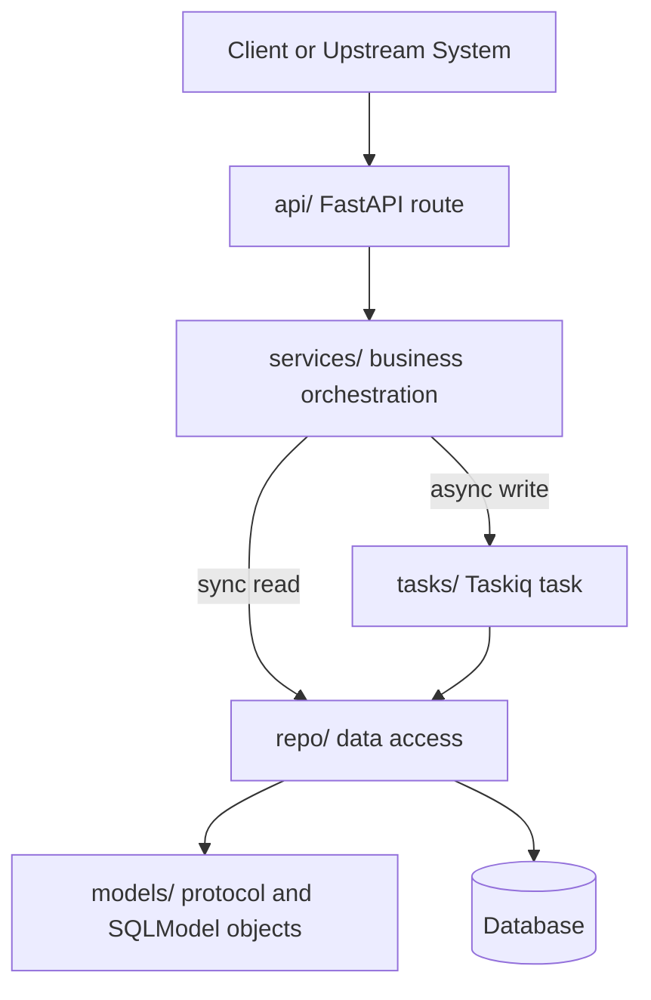
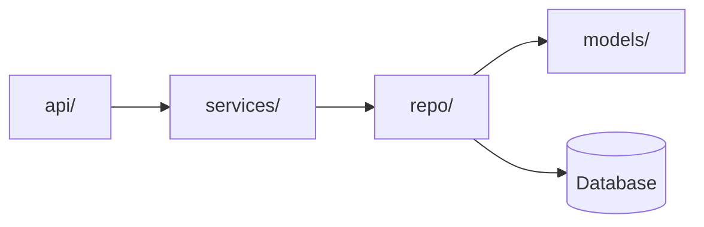
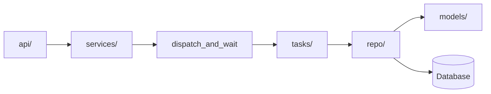
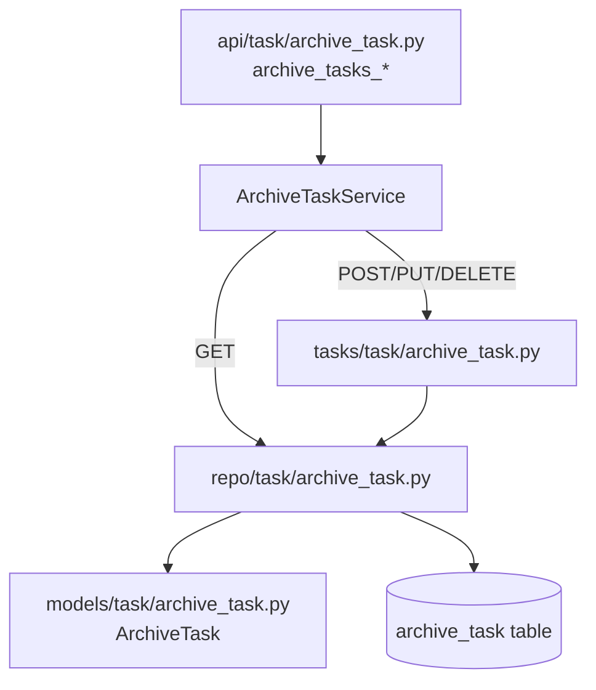

# Runtime Chain

本文件说明一个协议接口从 HTTP 入口到数据库的运行链路。分层职责以 `.ai/project/layers.md` 为准。

## 标准链路

## 读取路径

读取接口通常不需要 Taskiq。`services/` 可以直接调用 `repo/`，由 `repo/` 负责过滤、排序、分页和空结果语义。

## 写入路径

写入接口通过 `dispatch_and_wait` 进入 Taskiq 任务。`tasks/` 只作为异步任务入口，不直接承载数据库细节。

## A.6 `/VIAS/Tasks` 链路示例

