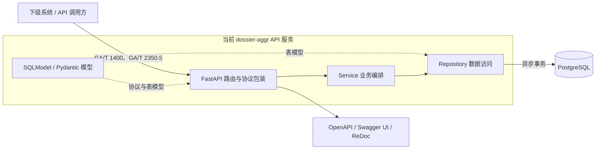
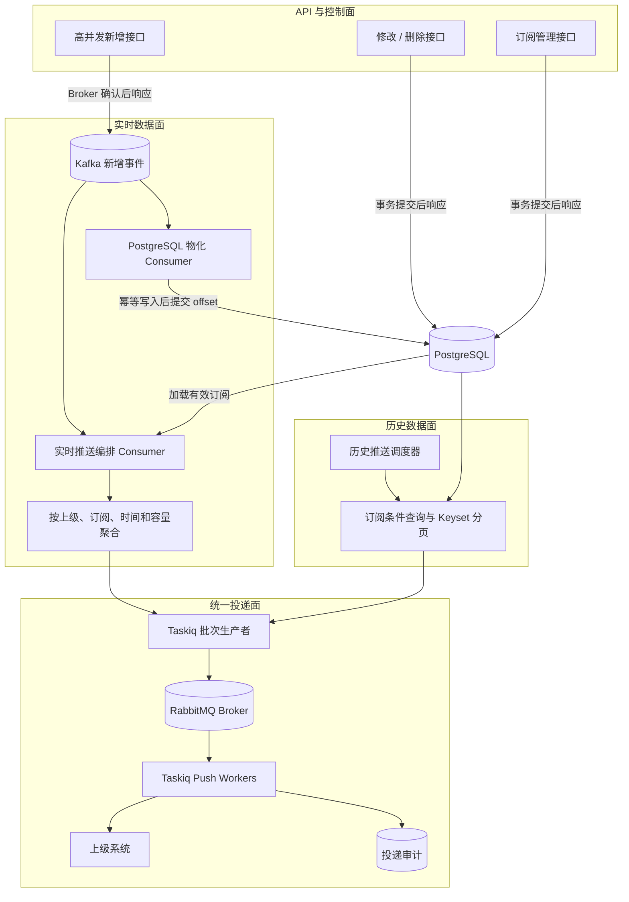

# dossier-aggr / VIID 服务系统



`dossier-aggr` 是一个基于 FastAPI 的视频图像信息数据库（VIID）接口服务，面向 GA/T 1400、GA/T 2350.5 等国内公共安全行业标准的协议实现、后端部署和系统集成联调。

当前仓库交付 API 服务和数据库迁移，不包含独立前端应用。

## 项目能力

- 覆盖 GA/T 1400-2017 与 2018 试行资料中的系统注册、保活、注销、校时、采集系统、采集设备、人员、人脸、订阅与通知等主链路。
- 覆盖 GA/T 2350.5-2025 目标聚档服务中的目标档案库、聚档任务、人员/车辆档案、档案明细和档案核验主链路。
- 自动生成 OpenAPI，并通过 Swagger UI 与 ReDoc 提供接口调试页面。
- 当前所有新增、查询、更新和删除请求都通过 Service 调用 Repository，并在
  PostgreSQL 事务提交完成后返回结果。
- 已确定高并发数据接入和出站订阅推送的目标架构，但 Kafka、Taskiq、RabbitMQ
  及对应 Worker 尚未实装，不能把目标架构视为当前运行能力。
- 提供 Dockerfile。

## 运行环境

| 项目       | 当前目标                           |
| ---------- | ---------------------------------- |
| Python     | 3.14                               |
| API 框架   | FastAPI                            |
| 数据模型   | SQLModel / Pydantic v2             |
| 数据库迁移 | Alembic                            |
| 写入方式   | SQLModel / SQLAlchemy AsyncSession |
| 开发数据库 | PostgreSQL                         |
| 生产数据库 | PostgreSQL                         |

> 仓库当前没有 GitHub Actions 工作流，因此 README 不展示远端 CI 通过徽章。质量状态以本地执行 `ruff check .`、`pyright`、`pytest -q` 的结果为准。

## 数据推送：当前状态与目标架构

本节记录后续实现边界，避免将当前同步接口与目标异步链路混为一谈。

| 能力                           | 当前实现                                                | 目标设计                                                         |
| ------------------------------ | ------------------------------------------------------- | ---------------------------------------------------------------- |
| 普通增改删                     | Service -> Repository -> PostgreSQL，同一请求内提交事务 | 保持当前同步事务路径                                             |
| 高并发新增                     | 仍直接写 PostgreSQL                                     | Kafka 确认后响应，由独立 Consumer 幂等物化到 PostgreSQL          |
| 实时出站推送                   | 未实现                                                  | 消费 Kafka 新增事件，匹配订阅并聚合为 Taskiq 批次                |
| 历史出站推送                   | 未实现                                                  | 按上级订阅条件查询 PostgreSQL，使用 Keyset 分页生成 Taskiq 批次  |
| 任务分发与执行                 | 未引入 Taskiq Broker 或 Worker                          | Taskiq + `taskiq-aio-pika` + RabbitMQ，Worker 调用上级 HTTP 接口 |
| `/VIID/SubscribeNotifications` | 接收入站通知，并支持查询和删除                          | 与出站推送解耦，不代表推送 Worker 已实现                         |

数据接入与上级推送采用历史、实时分流设计。高并发新增数据先进入 Kafka；
修改、删除和低并发订阅管理直接写 PostgreSQL。实时推送由独立消费者聚合
Kafka 数据，历史推送按每个上级的订阅条件查询 PostgreSQL；两条链路最终都
生成批量 Taskiq 任务，由 RabbitMQ Broker 分发给可水平扩容的推送 Worker。



### 组件边界

| 组件                     | 单一职责                                                         | 不负责                                   |
| ------------------------ | ---------------------------------------------------------------- | ---------------------------------------- |
| FastAPI                  | 协议校验；普通写入事务响应；高并发新增事件投递                   | HTTP 出站推送、长时间批次聚合            |
| Kafka                    | 承载高并发新增事件，供物化与实时编排两个 Consumer Group 独立消费 | 历史查询、修改删除、Taskiq 任务执行      |
| PostgreSQL 物化 Consumer | 幂等写入新增业务数据，提交成功后推进消费位点                     | 出站通知                                 |
| 实时推送编排器           | 缓存有效订阅、匹配新增事件、聚合稳定批次                         | 每条事件查询数据库、每条事件创建一个任务 |
| 历史推送调度器           | 按上级订阅条件和明确水位分页读取历史数据                         | 将历史数据重新写入 Kafka                 |
| Taskiq / RabbitMQ        | 生成和可靠分发批次任务，提供 Worker 背压入口                     | 判断 GA/T 协议业务是否成功               |
| Push Worker              | 调用上级接口，解析 HTTP 与协议状态，执行重试、限流和审计         | 在网络请求期间持有业务数据库事务         |

### 可靠性与容量边界

- Kafka 只承载高并发实时新增数据；修改、删除和订阅管理不经过 Kafka。
- 实时编排器不会为每条数据立即创建 Taskiq 任务，而是按上级、订阅、
  `ReportInterval`、最大条数和最大报文大小聚合后再提交批次。
- 历史数据因各上级查询条件不同，直接按订阅查询 PostgreSQL，不经过 Kafka；
  查询结果分批后直接提交 Taskiq。
- Taskiq 的生产 Broker 确定使用 RabbitMQ（`taskiq-aio-pika`）。Redis 可以用于
  缓存或限流，但不作为该推送链路的 Taskiq Broker。
- RabbitMQ 负责可靠分发 Taskiq 批次任务；HTTP 成功判定、可重试错误分类、
  重试次数和死信处理仍由 Taskiq 中间件及推送任务代码负责。
- 推送采用至少一次语义。批次必须使用稳定的 `batch_id` 和 `NotificationID`，
  Kafka 到 Taskiq 的重复交接以及 Worker 重投都必须幂等。
- 高并发新增改为 Kafka-first 后，成功语义将从“PostgreSQL 已提交”变为
  “Kafka 已可靠接收”；在真正实现前，现有接口仍按 PostgreSQL 事务提交语义运行。
- 新增事件尚未物化时，修改或删除可能先到达 PostgreSQL。实现阶段必须定义可测试的
  冲突或重试响应，不能静默丢失变更。
- 设计容量基线是实时新增 `5,000` 条/秒、最多 `10` 个上级，即最多
  `50,000` 条逻辑投递/秒。按每批 `100` 到 `200` 条估算，Taskiq 任务约为
  `250` 到 `500` 个/秒；最终参数必须由真实报文和上级接口压测确定。

完整的实时/历史时序、Broker 选型、失败语义、幂等键、背压指标和实施验收条件见
[数据推送架构设计](docs/data-push-architecture.md)。

## 协议资料

本仓库不分发标准原文。`.protocol/` 是本地原始协议资料目录，已被 `.gitignore` 忽略；协议判断先查 `.ai/protocols/` 下的索引，必要时回到本地 `.protocol/` 文件核验。

| 协议                              | 本地资料路径                                                                             | 公开参考                                                                                                                                                        |
| --------------------------------- | ---------------------------------------------------------------------------------------- | --------------------------------------------------------------------------------------------------------------------------------------------------------------- |
| GA/T 1400.1-2017 通用技术要求     | `.protocol/1400/GA-T 1400.1-2017 公安视频图像信息应用系统 第1部分：通用技术要求.doc`     | [国家数字标准馆](https://www.ndls.org.cn/standard/detail/f71a4415fcb5553126a987f4c79415c9)                                                                      |
| GA/T 1400.2-2017 应用平台技术要求 | `.protocol/1400/GA-T 1400.2-2017 公安视频图像信息应用系统 第2部分：应用平台技术要求.doc` | [国家数字标准馆](https://www.ndls.org.cn/standard/detail/764238571834b42cfbeb6fc31a47204c)                                                                      |
| GA/T 1400.3-2017 数据库技术要求   | `.protocol/1400/GA-T 1400.3-2017 公安视频图像信息应用系统 第3部分：数据库技术要求.doc`   | [国家数字标准馆](https://www.ndls.org.cn/standard/detail/87eccff00012e165e1ae34d25c3747f6)                                                                      |
| GA/T 1400.4-2017 接口协议要求     | `.protocol/1400/GA-T 1400.4-2017 公安视频图像信息应用系统 第4部分：接口协议要求.doc`     | [国家数字标准馆](https://www.ndls.org.cn/standard/detail/4ac5697f21cc24610b6f66da80722c1e)                                                                      |
| GA/T 1400 试行资料                | `.protocol/1400/20180521 视图库对接技术要-试行.pdf`                                      | 本地资料                                                                                                                                                        |
| GA/T 2350.5-2025 目标聚档服务     | `.protocol/2350/GA-T 2350.5-2025.pdf`、`.protocol/2350/GA-T 2350.5-2025.docx`            | [国家数字标准馆关联条目](https://www.ndls.org.cn/standard/detail/e9bd6546ff969e6a6335c973e1271738)、[公安部标准公告转载](https://www.secrss.com/articles/84327) |

## 功能清单

状态说明：`√` 表示当前仓库已有对应 API、模型和服务主链路；`×` 表示当前仓库未实现。带备注的 `√` 代表接口已存在，但仍有字段、查询语义或正式版细节需要继续核对。

### GA/T 1400

| 协议功能            | 典型路径                                    | 状态 | 说明                                                       |
| ------------------- | ------------------------------------------- | ---- | ---------------------------------------------------------- |
| 系统注册            | `/VIID/System/Register`                     | √    | Digest 鉴权；返回协议状态对象                              |
| 系统注销            | `/VIID/System/UnRegister`                   | √    | 返回协议状态对象                                           |
| 系统保活            | `/VIID/System/Keepalive`                    | √    | 返回协议状态对象                                           |
| 系统校时            | `/VIID/System/Time`                         | √    | 返回系统时间对象                                           |
| 视图库服务资源      | `/VIID/VIIDServers`                         | ×    | 未实现                                                     |
| 采集设备 APE        | `/VIID/APEs`                                | √    | 已实现查询和修改主链路                                     |
| 采集系统 APS        | `/VIID/APSs`                                | √    | 已实现查询主链路                                           |
| 卡口                | `/VIID/Tollgates`                           | ×    | 未实现                                                     |
| 车道                | `/VIID/Lanes`                               | ×    | 未实现                                                     |
| 视频片段元数据/数据 | `/VIID/VideoSlices`                         | ×    | 未实现                                                     |
| 图像元数据/数据     | `/VIID/Images`                              | ×    | 未实现                                                     |
| 文件元数据/数据     | `/VIID/Files`                               | ×    | 未实现                                                     |
| 人员                | `/VIID/Persons`                             | √    | 支持批量和单项查询、增加、修改、删除                       |
| 人脸                | `/VIID/Faces`                               | √    | 支持批量和单项查询、增加、修改、删除                       |
| 机动车              | `/VIID/MotorVehicles`                       | ×    | 未实现                                                     |
| 非机动车            | `/VIID/NonMotorVehicles`                    | ×    | 未实现                                                     |
| 物品                | `/VIID/Things`                              | ×    | 未实现                                                     |
| 场景                | `/VIID/Scenes`                              | ×    | 未实现                                                     |
| 案事件              | `/VIID/Cases`                               | ×    | 未实现                                                     |
| 布控                | `/VIID/Dispositions`                        | ×    | 未实现                                                     |
| 布控告警通知        | `/VIID/DispositionNotifications`            | ×    | 未实现                                                     |
| 订阅                | `/VIID/Subscribes`                          | √    | 支持订阅查询、创建、更新、删除、取消                       |
| 订阅通知            | `/VIID/SubscribeNotifications`              | √    | 当前支持入站通知上报、查询和删除；出站推送按目标架构待实施 |
| 分析规则            | `/VIID/AnalysisRules`                       | ×    | 未实现                                                     |
| 视频标签            | `/VIID/VideoLabels`                         | ×    | 未实现                                                     |
| VIAS 系统与能力     | `/VIAS/System*`、`/VIAS/SystemCapability/*` | ×    | 未实现                                                     |

### GA/T 2350.5

| 条款 | 协议功能           | 路径                                   | 状态 | 说明                                                      |
| ---- | ------------------ | -------------------------------------- | ---- | --------------------------------------------------------- |
| A.5  | 目标档案库         | `/VIID/ArchiveLibraries`               | √    | 已基本对齐                                                |
| A.6  | 聚档任务           | `/VIAS/Tasks`                          | √    | 主链路已实现；`Task` 字段仍需结合 GA/T 1399-2017 继续核对 |
| A.7  | 订阅               | `/VIID/Subscribes`                     | √    | 复用 1400 路由；2350 扩展语义仍需核对                     |
| A.8  | 订阅通知           | `/VIID/SubscribeNotifications`         | √    | 复用 1400 路由；已补齐部分 2350 扩展列表                  |
| A.9  | 人员档案查询       | `/VIID/ArchivesQuerySync`              | √    | 查询行为尚未覆盖正式版全部检索语义                        |
| A.10 | 人员档案增改删     | `/VIID/Archives`                       | √    | 批量增加、修改、删除主链路                                |
| A.11 | 车辆档案查询       | `/VIID/VehicleArchivesQuerySync`       | √    | 查询行为尚未覆盖正式版全部检索语义                        |
| A.12 | 车辆档案增改删     | `/VIID/VehicleArchives`                | √    | 批量增加、修改、删除主链路                                |
| A.13 | 人员档案明细查询   | `/VIID/ArchiveSubjectQuerySync`        | √    | 查询行为尚未覆盖正式版全部检索语义                        |
| A.14 | 人员档案明细增改删 | `/VIID/ArchiveSubjects`                | √    | 删除支持正式版五类删除键                                  |
| A.15 | 车辆档案明细查询   | `/VIID/VehicleArchiveSubjectQuerySync` | √    | 查询行为尚未覆盖正式版全部检索语义                        |
| A.16 | 车辆档案明细增改删 | `/VIID/VehicleArchiveSubjects`         | √    | 删除支持正式版五类删除键                                  |
| A.17 | 人员档案核验       | `/VIID/ArchiveConfidence`              | √    | 成功响应使用 `ArchiveList`                                |
| A.18 | 车辆档案核验       | `/VIID/VehicleArchiveConfidence`       | √    | 成功响应使用 `VehicleArchiveList`                         |

## 快速开始

创建 Python 3.14 环境并安装运行及开发依赖：

```bash
python -m pip install --upgrade pip
python -m pip install --group dev
```

生产环境只安装 `pyproject.toml` 中的 `runtime` 依赖组：

```bash
python -m pip install --group runtime
```

执行数据库迁移并启动 API 服务：

```bash
ENV=dev alembic upgrade head
ENV=dev uvicorn main:app --host 0.0.0.0 --port 8000
```

服务启动后可访问：

| 入口         | 地址                               |
| ------------ | ---------------------------------- |
| Swagger UI   | http://127.0.0.1:8000/docs         |
| ReDoc        | http://127.0.0.1:8000/redoc        |
| OpenAPI JSON | http://127.0.0.1:8000/openapi.json |

## 接口示例

获取 OpenAPI 描述：

```bash
curl http://127.0.0.1:8000/openapi.json
```

GA/T 1400 保活接口：

```bash
curl -X POST http://127.0.0.1:8000/VIID/System/Keepalive \
  -H 'Content-Type: application/json' \
  -d '{"KeepaliveObject":{"DeviceID":"APS-003"}}'
```

## 开发命令

```bash
ruff check .
pyright
pytest -q
```

数据库迁移：

```bash
alembic upgrade head
alembic revision --autogenerate -m "describe change"
```

新增接口在数据库事务成功后返回“已接收”；后续查询可以立即看到已提交的数据。

## Docker

构建并运行 API 镜像：

```bash
docker build -t dossier-aggr:local .
docker run --rm -p 8000:8000 -e ENV=dev dossier-aggr:local
```

容器默认启动命令：

```bash
uvicorn main:app --host 0.0.0.0 --port 8000
```

## 项目结构

```text
api/              FastAPI 路由与协议入口
services/         业务编排层
repo/             数据访问层
models/           SQLModel/Pydantic 协议模型与数据库模型
alembic/          数据库迁移
core/             配置、数据库和通用基础设施
docs/             公开设计、实现约定和协议说明
tests/            单元、协议、服务、仓库和迁移测试
pyproject.toml    运行/开发依赖和 Python 工具配置
.ai/              AI 协作上下文、协议索引和开发流程文档
.protocol/        本地协议原始资料，已被 git 忽略
```

## Roadmap

- 按[数据推送架构设计](docs/data-push-architecture.md)实施 Kafka 实时接入、
  PostgreSQL 历史查询以及 Taskiq + RabbitMQ 批量推送链路。
- 继续对齐 GA/T 2350.5-2025 正式版字段、查询约束和响应细节。
- 补充真实 PostgreSQL 场景的并发写入与事务回归测试。
- 细化附录扩展字段的查询与过滤约束。
- 补充贡献指南、安全策略和发布流程文档。

## License

本项目采用 MIT License，详见 [LICENSE](LICENSE)。
