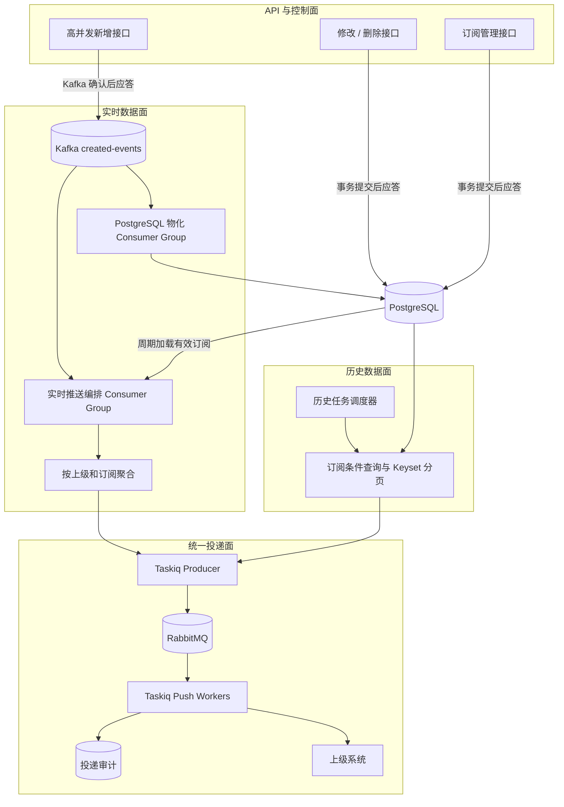
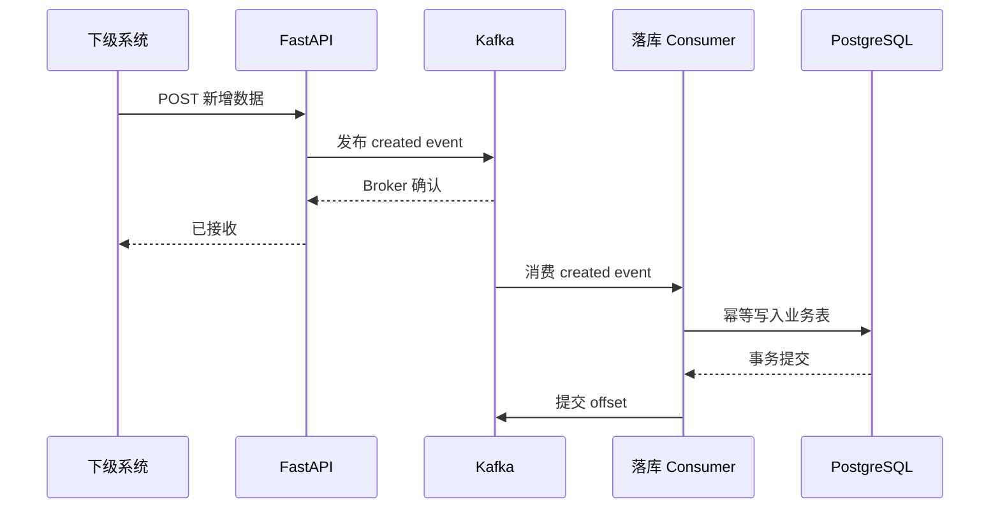
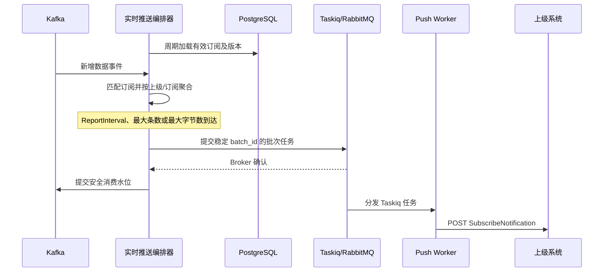
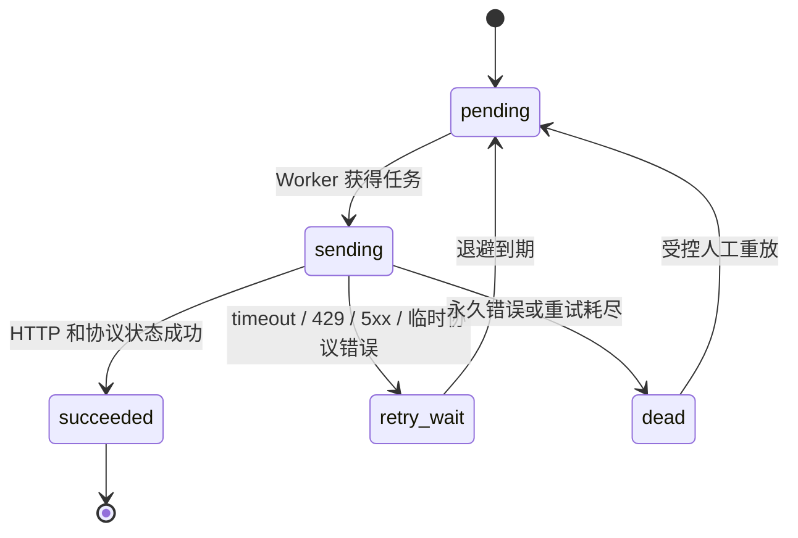

# 数据推送架构设计

本文是 `dossier-aggr` 后续数据推送实现的公开架构基线。文档记录已经确定的
组件边界、数据流、可靠性语义和实施顺序；协议字段仍应以本地 `.protocol/`
原文为准。

当前仓库尚未实现本文描述的 Kafka、Taskiq、RabbitMQ、实时推送编排器或历史
推送任务。现有 `/VIID/SubscribeNotifications` 是入站通知接口，不能视为出站
推送已经完成。

## 1. 目标与约束

目标容量基线：

- 高并发新增数据：`5,000` 条/秒。
- 上级系统：按最多 `10` 个估算。
- 最大逻辑扇出：`5,000 x 10 = 50,000` 条/秒。
- 推送必须批量执行，不能为每条数据创建一个 Taskiq 任务。
- 接收、实时编排、历史查询和 HTTP 推送必须能够独立部署和水平扩容。

已经确定的业务边界：

- 高并发新增数据通过 Kafka 接入并异步物化到 PostgreSQL。
- 修改和删除直接写 PostgreSQL，不进入 Kafka，也不作为实时订阅数据向上级推送。
- 订阅创建、更新、取消属于低频控制操作，直接写 PostgreSQL。
- 实时数据来自 Kafka，历史数据来自 PostgreSQL。
- 历史与实时的数据选择方式不同，但共用 Taskiq 推送 Worker、重试、限流、
  幂等和审计能力。
- 数据进入 Kafka 不等于立即向上级发送。实时编排器应按订阅和上级要求聚合，
  达到时间、条数或字节阈值后才创建 Taskiq 批次任务。

## 2. 总体架构



同一仓库可以交付这些组件，但生产环境应以独立进程或独立 Deployment 运行：

1. FastAPI API。
2. Kafka 数据落库消费者。
3. Kafka 实时推送编排器。
4. 历史推送调度器/生产者。
5. Taskiq 推送 Worker。

各组件使用同一份协议模型和业务代码，但具有独立连接池、并发限制、健康检查和
扩容策略。当前阶段不要求拆成多个代码仓库。

## 3. 数据接入路径

### 3.1 高并发新增

被确认需要承载高并发的新增接口采用 Kafka-first：



这会把新增接口成功语义从“PostgreSQL 已提交”改成“Kafka 已可靠接收”。因此实现
时必须同步修改接口说明和测试，并接受新增数据在 PostgreSQL 中短暂不可见的最终
一致性窗口。

建议的事件信封至少包含：

```json
{
  "event_id": "uuid",
  "event_type": "resource.created",
  "schema_version": 1,
  "occurred_at": "2026-08-21T00:00:00Z",
  "resource_type": "face",
  "resource_id": "F-001",
  "partition_key": "face:F-001",
  "payload": {}
}
```

Kafka key 使用 `resource_type + resource_id`，保证同一资源在同一分区。数据落库
消费者以 `event_id` 或业务唯一键幂等，只有 PostgreSQL 提交成功后才能提交
Kafka offset。

### 3.2 修改、删除和订阅

修改、删除以及订阅管理保持当前同步路径：

```text
FastAPI -> Service -> Repository -> PostgreSQL commit -> HTTP response
```

它们不进入 Kafka，也不触发实时出站通知。

该选择存在一个必须显式处理的竞态：新增事件已经写入 Kafka但尚未物化到
PostgreSQL 时，同一资源的修改或删除可能先到达数据库。第一阶段至少应定义为
可识别的冲突或暂时不可用响应，并要求调用方重试；如果业务不能接受该语义，
则必须为同一资源增加有序变更通道，不能静默丢失修改或删除。

## 4. 实时推送

实时推送编排器是独立的 Kafka consumer group。它与数据落库 consumer group
分别消费同一新增事件流，互不占用对方的消息。



编排器不能针对每条事件查询一次 PostgreSQL。有效订阅应保存在进程内缓存中，
并根据订阅版本或 `updated_at` 周期增量刷新。订阅量属于低并发控制数据，因此
这种周期查询不会使 PostgreSQL进入实时数据热路径。

聚合键至少包括：

```text
upstream_id + subscribe_id + resource_type + report_window
```

批次在任一条件满足时封装：

- `ReportInterval` 窗口结束。
- 达到最大记录数。
- 达到最大序列化字节数。

实时编排器可以部署多个实例，由 Kafka 分区和 consumer group 分配负载。短窗口
可以使用内存聚合，但必须在 Taskiq Broker 确认后才推进 Kafka 安全消费水位；
进程崩溃导致的数据重放依靠稳定批次 ID 去重。长窗口或大报文聚合应增加可恢复的
状态存储，不能无限占用进程内存。

## 5. 历史推送

历史任务由上级订阅、计划任务或受控的人工操作启动。每个上级可以有不同的资源、
过滤条件、时间范围和图片/特征声明，因此应分别查询 PostgreSQL。


历史查询结果不进入 Kafka。Kafka 的职责是实时新增数据流，而不是所有推送任务的
统一入口。历史任务直接向 Taskiq 提交批次，可避免不必要的 Kafka 往返，也保留
每个上级独立的查询计划。

历史查询必须使用 Keyset Pagination，避免在大表上使用不断增长的 `OFFSET`。
历史批次 ID 应由 `history_job_id + subscribe_id + page/range` 稳定生成，以便任务
重复提交时保持幂等。

如果同一订阅同时启用历史和实时推送，必须在任务创建时记录明确的截止水位或时间
边界，规定历史覆盖范围和实时起点，并通过幂等台账避免边界重复。

## 6. Taskiq Broker 选型

生产推送链路确定使用：

```text
Taskiq + taskiq-aio-pika + RabbitMQ
```

该选择是在 Taskiq 使用场景下做出的，不只是 RabbitMQ 和 Redis 的产品比较。
Taskiq 的任务声明和 `.kiq()` 调用方式在不同 Broker 间基本一致，但 Broker 适配器
决定底层投递确认、崩溃重投、预取和持久化能力。

| Taskiq 关注点 | RabbitMQ / `taskiq-aio-pika` | Redis Broker |
| --- | --- | --- |
| 消费确认 | AMQP ACK/NACK 和未确认消息重投语义成熟 | 取决于 Pub/Sub、List 或 Streams 具体实现 |
| Worker 崩溃恢复 | 未确认任务可重新投递 | 不同 Redis Broker 实现差异较大 |
| 背压 | prefetch/QoS 可限制 Worker 预取 | 主要依赖具体实现及 Worker 并发配置 |
| 持久队列 | durable queue 与 persistent message | 依赖 AOF/RDB、复制和淘汰策略 |
| 隔离与路由 | exchange、routing key、queue 能力成熟 | 通常使用不同 key/list/stream 隔离 |
| 运维观察 | 队列、ready、unacked、consumer 指标清晰 | 需要按所选数据结构建设观察能力 |

推送任务经过批处理后，按每批 `100` 到 `200` 条估算约为 `250` 到 `500` 个
Taskiq 任务/秒；这个任务量下 Broker 峰值吞吐不是主要矛盾，可靠确认、慢上级
隔离、背压和故障恢复更重要，因此选择 RabbitMQ。

Redis可以用于订阅缓存、分布式限流或短期幂等键，但不作为本链路的生产 Taskiq
Broker。推送调用方不等待任务返回结果，投递状态写入审计表，因此默认也不需要
Taskiq Result Backend。

需要特别说明：RabbitMQ 不会自动理解 HTTP 或 GA/T 协议是否成功。Taskiq 任务
必须解析 HTTP 状态和 `ResponseStatusListObject`，再决定成功、重试或最终失败。
延迟重试需要在锁定 Taskiq 插件版本后，通过 Taskiq 重试中间件以及 RabbitMQ
重试队列/TTL/DLX 等能力落地并进行故障测试，不能仅因为选用了 RabbitMQ 就假设
业务重试已经完成。

## 7. 批次、载荷与幂等

### 7.1 批处理

容量基线下的逻辑扇出为：

```text
5,000 条/秒 x 10 个上级 = 50,000 条逻辑投递/秒
```

批量后的任务量约为：

```text
每批 100 条 -> 约 500 个任务/秒
每批 200 条 -> 约 250 个任务/秒
```

批处理只降低任务数和 HTTP 请求数，不降低网络字节数。如果平均单条协议数据为
`10 KB`，十倍扇出已经接近 `500 MB/s` 的业务载荷；包含 Base64 图片时可能更高。
因此压测必须同时测记录数、序列化字节数、图片比例和上级响应时间。

Taskiq 任务应优先携带小型批次描述和稳定引用。大型图片或超大 JSON 不能无限制
塞入 RabbitMQ；实现时必须设置任务消息最大字节数，并为超限批次采用不可变载荷
存储或更小批次。具体阈值应由 RabbitMQ 和真实协议报文压测确定。

### 7.2 Kafka 到 Taskiq 的交接

Kafka 和 RabbitMQ之间没有原子事务：

1. 编排器向 Taskiq/RabbitMQ 提交任务。
2. RabbitMQ 确认后，编排器提交 Kafka offset。
3. 如果步骤 1 成功、步骤 2 前进程崩溃，Kafka 会重放并再次提交同一任务。

因此系统采用至少一次语义，不能承诺恰好一次。实时批次 ID建议稳定包含：

```text
subscribe_id + topic + partition + first_offset + last_offset + schema_version
```

历史批次 ID建议稳定包含：

```text
history_job_id + subscribe_id + page_or_key_range
```

同一 `batch_id` 必须映射到同一 `NotificationID`。投递审计表对 `batch_id` 和
`NotificationID` 建唯一约束；Worker 收到重复任务时复用已有结果，不生成新的
通知标识。上级接收方也应按 `NotificationID` 幂等。

## 8. 发送、重试和隔离



发送策略：

- HTTP `2xx` 不等于业务成功，必须解析协议状态对象。
- 超时、连接失败、`429` 和可恢复的 `5xx` 使用指数退避和随机抖动。
- 明确的认证失败、参数错误和协议不兼容默认进入最终失败，避免无限重试。
- 重试必须复用同一批次载荷和 `NotificationID`。
- 每个上级分别配置并发、QPS、批次大小、超时和积压上限。
- 慢上级不能占满所有 Worker；应按上级路由到隔离队列或受控的队列分片。
- Worker 在网络调用期间不持有 PostgreSQL 事务。

RabbitMQ 负责可靠分发和积压，Taskiq 中间件及任务代码负责业务重试决策，
PostgreSQL 投递审计仅保存状态、次数、错误摘要和时间，不承担高吞吐任务队列职责。

## 9. 数据模型与内部状态

后续实现至少需要以下内部实体，具体字段通过模型和 Alembic 迁移落地：

- `PushBatch`：`batch_id`、`NotificationID`、上级、订阅、模式（历史/实时）、
  记录数、载荷引用或快照哈希、创建时间。
- `PushDelivery`：状态、尝试次数、下次重试时间、最近 HTTP/协议状态、错误摘要、
  成功时间。
- `HistoryPushJob`：上级、订阅、查询范围、分页游标、截止水位、任务状态。
- 订阅内部版本或 `updated_at`：供实时编排器增量刷新缓存。
- 数据落库幂等记录：防止 Kafka 重放造成重复插入。

这些是内部运行模型，不应混入 GA/T 协议对象，也不应改变公开字段大小写。

## 10. 可观测性与背压

至少采集：

- Kafka producer 延迟、错误率和各 consumer group lag。
- 每个上级和订阅的匹配数、批次数、记录数和字节数。
- RabbitMQ ready、unacked、publish/ack 速率和最老任务年龄。
- Taskiq 任务执行时间、成功率、重试数和最终失败数。
- 上级 HTTP p50/p95/p99、状态码、协议错误和限流次数。
- PostgreSQL 物化延迟、历史查询耗时和连接池占用。
- 历史任务进度以及历史/实时边界重复数。

背压顺序应为：限制单上级并发、暂停该上级新批次、保留 Kafka lag 或历史游标，
而不是让慢上级拖慢所有数据接入和其他上级。

## 11. 实施顺序

1. 核验协议原文，确认 `SubscribeDetail`、`ReceiveAddr`、`ReportInterval`、通知字段、
   Digest 认证以及上级幂等要求。
2. 定义版本化新增事件信封、Kafka topic、分区键和错误 topic；实现高并发新增 API
   与幂等 PostgreSQL 物化消费者。
3. 增加订阅内部版本和实时编排器，完成订阅缓存、匹配、窗口聚合和稳定批次 ID。
4. 引入固定版本的 Taskiq、`taskiq-aio-pika` 和 RabbitMQ，完成批次任务、HTTP
   Worker、投递审计、限流、重试和最终失败处理。
5. 实现按上级订阅查询 PostgreSQL 的历史任务、Keyset 分页和历史/实时边界。
6. 进行 `5,000` 条/秒、`10` 个上级的端到端容量测试，并加入 Kafka 重放、
   RabbitMQ 重启、Worker 强制退出、慢上级、上级长时间不可用等故障测试。
7. 根据报文大小和压测结果确定 Kafka 分区数、Taskiq Worker 数、RabbitMQ 队列
   拓扑、批次阈值、载荷存储方式和保留周期。

## 12. 实现验收条件

- 新增 API 在 Kafka 未确认时不能返回成功。
- 数据落库消费者重放不会产生重复业务数据。
- 修改、删除早于新增物化时有明确且经过测试的响应语义。
- 实时编排器不会为每条数据创建一个 Taskiq 任务。
- 历史查询结果不经过 Kafka，并且不同上级使用各自的订阅条件。
- Kafka offset 只在对应 Taskiq 批次获得 Broker 确认后推进。
- Kafka 重放或 Taskiq 重投保持相同 `batch_id` 和 `NotificationID`。
- 单个慢上级不会阻塞其他上级。
- Worker 崩溃、RabbitMQ 重启和 HTTP 超时后任务可恢复且不会静默丢失。
- `ruff check .`、`pyright`、`pytest -q` 以及目标容量压测均有可追溯结果。

## 13. 尚待协议核验

当前工作区没有可用的 `.protocol/` 原文，以下结论不能仅依赖现有模型：

- `SubscribeDetail` 的正式过滤表达方式。
- `ReceiveAddr` 是完整通知 URL 还是服务基址。
- `ReportInterval` 是聚合窗口、最小间隔还是周期快照定义。
- 历史订阅的时间边界以及是否允许存量补发。
- 各资源在 `SubscribeNotification` 中的正式字段和必填性。
- 上级通知接口的认证方式、成功状态和可重试协议状态。

实施相关字段前必须核验原文并用协议契约测试固定结论。
