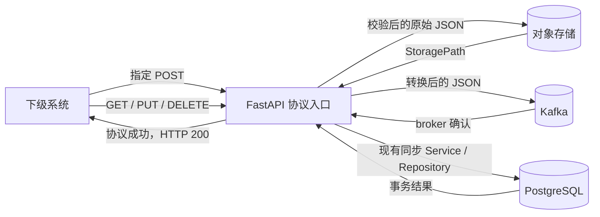

# Kafka 高并发数据接入设计

本文记录 `dossier-aggr` 第一阶段高并发 POST 接口接入 Kafka 的实现边界。

当前采用同步直传模式：FastAPI 完成协议校验后，在同一请求中先上传对象存储图片，
再发送 Kafka；两步都成功后才返回 HTTP 200。

```text
HTTP 请求 -> 协议校验 -> 对象存储上传 -> Kafka 发送 -> HTTP 200
```

Kafka 消费、批量写入 PostgreSQL、出站订阅推送、入站台账和链路追踪均不在本阶段
实现。后续需要批量物化 Kafka 数据时，再单独讨论 consumer 和 PostgreSQL 批量写入
方案。

涉及 GA/T 1400 和 GA/T 2350.5 的接口、字段、外层对象及响应状态时，仍应以本地
`.protocol/` 原文为准。当前工作区没有 `.protocol/` 和 `.ai/`，机动车、非机动车
接口及完整图片字段在编码前仍需补充协议原文和契约测试。

## 1. 当前状态与目标

当前所有已实现写接口使用同步事务路径：

```text
FastAPI -> Service -> Repository -> PostgreSQL commit -> HTTP success
```

在均值约 `10,000` 的高并发新增流量下，逐请求写 PostgreSQL 无法满足目标吞吐。
第一阶段将指定 POST 改为快速接入模式，使 PostgreSQL、对象存储和 Kafka 网络响应
都不处于这些 POST 请求的同步响应路径中。

当前 POST 成功语义是：

```text
协议校验通过 + 图片已上传 + Kafka broker 已确认消息
```

它不表示数据已经写入 PostgreSQL；Kafka 消费和 PostgreSQL 物化仍由系统外部流程负责。

该选择优先降低接口响应时间，但需要明确接受以下代价：

- 对象存储或 Kafka 失败会在本次 HTTP 请求中返回错误，调用方可以重试。
- 本阶段不提供自动补偿、台账或 DLQ；重试幂等性由调用方和下游契约负责。

## 2. 第一阶段范围

### 2.1 接入 Kafka 的 POST

| HTTP 接口 | 资源 | 当前仓库状态 |
| --- | --- | --- |
| `POST /VIID/SubscribeNotifications` | 入站订阅通知 | 已有接口，待改造 |
| `POST /VIID/Faces` | 人脸 | 已有接口，待改造 |
| `POST /VIID/Persons` | 人体/人员 | 已有接口，待改造 |
| `POST /VIID/MotorVehicles` | 机动车 | 尚未实现接口和完整模型 |
| `POST /VIID/NonMotorVehicles` | 非机动车 | 尚未实现接口和完整模型 |

`POST /VIID/Archives`、`POST /VIID/ArchiveSubjects`、车辆档案和档案明细暂不接入
Kafka，继续使用当前 PostgreSQL 同步事务路径。

### 2.2 不进入 Kafka 的操作

- 所有 `GET` 查询。
- 所有 `PUT` 修改。
- 所有 `DELETE` 删除。
- 订阅创建、修改、取消等低频控制面操作。
- 未列入上一节的其他 POST。

GET、PUT 和 DELETE 继续同步访问 PostgreSQL。调用方需要修改或删除刚刚 POST 的
对象时，应先等待数据完成后续物化并通过 GET 确认存在，再调用 PUT 或 DELETE。
这些同步接口自身不等待 Kafka 数据落库。

### 2.3 明确排除

第一阶段不实现：

- Kafka consumer 或 PostgreSQL 批量物化进程。
- consumer lag、消费重试、DLQ 和物化状态查询。
- 入站事件台账和 `event_id`、`batch_id`。
- 请求链路追踪 ID 和额外追踪字段。
- 根据订阅向上级系统发送数据。
- 实时或历史出站推送编排。
- Taskiq、RabbitMQ 或推送 Worker。

`/VIID/SubscribeNotifications` 在本阶段仍然只是接收下级系统通知的入站接口，不能
据此认为系统已经具备主动向上级推送的能力。

## 3. 同步投递流水线

### 3.1 请求路径



处理顺序固定为：

1. API 完成认证、HTTP 参数解析和完整协议模型校验。
2. 保留原始 JSON 的字段、大小写、外层对象和列表结构。
3. 在当前请求中处理其中的 Base64 图片并上传对象存储。
4. 图片上传成功后，将 `StoragePath` 设置为返回地址，将 `Data` 设置为 `null`。
5. 将转换后的完整 JSON 同步发送 Kafka，并等待 broker 确认。
6. Kafka 成功后返回现有 `ResponseStatusListObject` 和 HTTP 200。

### 3.2 S3 上传与 Kafka 发送顺序

同一个请求的两个步骤不能并行：Kafka JSON 需要包含上传后得到的 `StoragePath`，
所以必须先完成该请求的图片上传和 JSON 替换，再发送 Kafka。

### 3.3 不使用进程内后台队列

消息投递不使用 `BackgroundTasks`、内存队列或固定 Worker。请求会占用一个 HTTP
连接直到对象存储和 Kafka 都完成，因此部署时应通过 Web 服务器并发上限、对象存储
连接池和 Kafka 客户端超时控制整体资源。若需要高并发缓冲、重试或持久化，应先单独
定义消息队列及其幂等、失败重试和顺序契约，再扩展本架构。

## 4. Topic 与分区

### 4.1 Topic 名称

Topic 只按接口划分，第一阶段不加环境前缀：

| HTTP 接口 | Kafka Topic |
| --- | --- |
| `/VIID/SubscribeNotifications` | `viid.subscribe-notifications.v1` |
| `/VIID/Faces` | `viid.faces.v1` |
| `/VIID/Persons` | `viid.persons.v1` |
| `/VIID/MotorVehicles` | `viid.motor-vehicles.v1` |
| `/VIID/NonMotorVehicles` | `viid.non-motor-vehicles.v1` |

Topic 后缀 `.v1` 表示 Kafka value 结构的第一版。若未来协议 JSON 结构产生不兼容
变化，应创建新的版本 Topic，不在原 Topic 中混放两种不兼容结构。

### 4.2 初始分区数

五个 Topic 的初始分区数统一设为：

```text
12 partitions per topic
```

选择 `12` 的原因：

- Base64 外置后单条 Kafka record 以 JSON 元数据为主，单分区吞吐压力会明显降低。
- 单个 Topic 后续最多可以由 `12` 个 consumer 实例或消费任务并行处理。
- 当流量集中到某一个接口时，仍有足够的并行扩展空间。
- 相比一开始建立几十个分区，`12` 对小型 Kafka 集群的元数据和文件句柄开销更可控。

分区数决定未来 consumer group 的最大并行度，但不保证 consumer 一定足够快。当前
不设置 Kafka record key，由 producer 在分区间均匀分配。

## 5. Kafka 消息内容

### 5.1 一次请求一条消息

第一阶段采用：

```text
一个 HTTP POST 请求 = 一条 Kafka record
```

Kafka value 是完成图片替换后的原始请求 JSON：

- 保留原请求的外层对象。
- 保留原字段名称和大小写。
- 保留原列表和对象层级。
- 不增加事件 envelope。
- 不增加 `event_id`、`batch_id`、`operation` 或资源类型字段。
- 不增加或删除协议字段。
- 图片对象的 `StoragePath` 改为对象存储返回地址。
- 图片对象的 `Data` 改为 `null`。
- 除 `StoragePath` 和 `Data` 外，不主动修改其他字段值。

实现时以原始 JSON 树作为 Kafka value 的数据来源，同时使用协议模型完成校验。
不能直接序列化一个填充了默认值的模型并写入 Kafka，否则可能把调用方未提交的默认
字段加入消息。

图片对象需要保留 `StoragePath` 和 `Data` 两个协议字段，只修改它们的值。如果请求
缺少这两个协议字段，具体兼容方式需要在协议原文可用后确认。

清理 Base64 后的请求如果仍超过配置的 Kafka record 上限，后台 Kafka Worker 记录
失败日志并丢弃本条消息；由于 HTTP 已经返回，本阶段不向调用方补发错误。

### 5.2 不生成额外 ID 或 Key

协议请求已经包含 `NotificationID`、`FaceID`、`PersonID` 等业务 ID，第一阶段不
生成额外 `event_id` 和 `batch_id`，也不添加请求链路追踪 ID。

Kafka record key 暂时保持为空。对象存储所需的底层 object key 或 object ID 由
对象存储 adapter 在内部生成，业务 Service 不制定 key 规则，也不把该技术字段加入
Kafka JSON。

### 5.3 最小 Header

Topic 已经表示接口类型，协议 JSON 已有业务 ID，所以第一阶段只设置一个自定义
header：

```text
content-type = application/json
```

不增加 `request-id`、`traceparent`、`received-at`、`request-path` 或自定义 schema
header。版本由 Topic 的 `.v1` 后缀表达。

## 6. Base64 与对象存储

### 6.1 平台无关适配

业务代码不直接依赖某一家 S3 产品或 SDK。对象存储适配器位于独立的 `s3/` 包，消息
传输包 `message/` 不包含 S3 配置或 SDK 依赖。S3 配置统一由 `core/settings.py` 提供，
业务层只依赖统一的异步对象存储接口：

```text
upload(bucket, content, content_type) -> storage_path
```

具体 adapter 可以对接 AWS S3、MinIO、Ceph、阿里云 OSS、华为云 OBS 或其他对象
存储平台。Service 只传入逻辑 bucket 和图片内容，并把 adapter 返回值写入
`StoragePath`，不处理 endpoint、签名、底层 object key 或 URL 拼接。

不同平台的上传响应并不统一：有的平台返回对象 ID 或稳定地址；标准 S3 `PutObject`
通常要求客户端先提供 bucket 和 object key，响应主要返回 ETag/version，并不会自动
返回可长期使用的 URL。因此 adapter 的职责是：

1. 在平台要求时生成内部 object key。
2. 调用对应平台上传 API。
3. 优先采用平台返回的稳定对象地址。
4. 平台不返回地址时，根据本次上传结果生成系统内部可长期解析的地址。
5. 将最终地址作为 `storage_path` 返回给 Service。

Kafka 中不能保存会过期的临时签名 URL。`StoragePath` 对业务层是不透明字符串，未来
读取图片时仍通过同一对象存储 adapter 解析，不在业务代码中按某个平台拼 URL。

### 6.2 按日期划分 bucket

第一阶段按中国时区的接收日期选择逻辑 bucket，默认命名模板为：

```text
viid-{YYYYMMDD}
```

例如：

```text
viid-20260831
```

不同存储平台对 bucket/container 的命名、数量限制和创建方式不同。日期和逻辑 bucket
名由 Service 生成，实际 bucket 创建、存在性检查以及必要的平台名称映射由 adapter
负责。adapter 应缓存当日 bucket 的就绪状态，不能在每张图片上传前重复创建或检查。

第一阶段不在业务层制定 object key，也不计算图片 SHA-256。底层平台如果必须提供
object key，由 adapter 内部使用其默认或简单随机标识生成；后续再讨论稳定 key、
内容去重和完整性校验。

### 6.3 为什么不计算 SHA-256

SHA-256 可以用于内容去重和完整性校验，但需要完整遍历解码后的图片字节。在低性能
服务器和大量图片并发场景中会增加 CPU 工作。

第一阶段没有内容去重要求，所以不计算 SHA-256。当前优先缩短处理路径；后续只有在
确认需要去重或完整性校验，并完成 CPU 压测后再增加哈希。

### 6.4 图片字段替换

对于协议图片字段，例如当前模型中的 `SubImageInfo`：

1. `Data` 包含 Base64 时，解码并上传对象存储。
2. 上传成功后，将 adapter 返回地址写入 `StoragePath`。
3. 将 `Data` 设置为 `null`。
4. 其他字段保持原值，不新增或删除字段。

对象存储外置减少的是 Kafka 消息大小、Kafka 网络复制流量和 Kafka 磁盘占用，
不会减少下级系统到 FastAPI 的入站带宽。

## 7. 队列、Producer 与失败日志

### 7.1 两类内存缓冲

本设计存在两类不同的内存缓冲：

- 应用接入队列和 Kafka 队列：保存等待后台 Worker 处理的请求，通常按消息数量限制。
- Kafka producer 内部缓冲：保存等待组批和发送的序列化 records，主要按内存字节数
  和批次大小管理，不只是“推送数量”。

Base64 请求可能很大，所以应用队列即使按数量限制，也必须评估实际内存占用。接入
队列入队失败发生在 HTTP 返回前，应返回协议失败。HTTP 200 返回后的对象存储失败、
Kafka 队列积压、producer 缓冲区不足或 Kafka 最终发送失败，只记录错误日志。

第一阶段不建设复杂指标、自动补偿或持久化队列。至少记录：

- 接口路径和协议已有业务 ID。
- 失败阶段：`storage_upload`、`kafka_enqueue` 或 `kafka_send`。
- 异常类型和错误摘要。
- 当前应用队列长度或 producer 缓冲相关错误。

日志不能记录原始 Base64、完整请求体、对象存储凭证或 Kafka 认证信息。

### 7.2 Kafka producer

FastAPI 进程复用一个长生命周期的异步 Kafka producer，由应用 lifespan 启动和
关闭，不能每个请求创建 producer 或 Kafka 连接。

第一阶段至少配置：

- 后台发送使用 `acks=all`，用于确认并记录最终发送结果，但 HTTP 响应不等待该确认。
- 开启 producer 幂等能力，处理 producer 自身的安全重试。
- 使用有界发送超时，最终失败后记录日志。
- 消息压缩算法通过小规模测试后选择，初始可使用 `lz4`。
- producer 缓冲区不足时记录错误，不无限增加 API 进程内存。

对象存储客户端和 Kafka producer 均复用异步长连接。对象存储 Worker 和 Kafka Worker
分别配置固定并发数，不能为每张图片或每条消息无限制创建任务。

### 7.3 进程关闭

正常关闭时，lifespan 应停止接收新任务，并在有限超时时间内尝试清空应用队列和刷新
Kafka producer。超过关闭超时的剩余任务允许丢失并记录日志。强制退出无法保证执行
该流程，这是快速响应且仅使用内存队列的已知限制。

## 8. 代码分层

实现继续遵守现有分层：

- `api/` 负责 HTTP 参数、依赖注入、协议模型校验和响应包装。
- `services/` 负责在请求内编排原始 JSON 的 Base64 外置、字段替换和 Kafka 投递。
- 对象存储和 Kafka producer 通过基础设施 adapter 提供，不在路由中直接调用 SDK。
- `repo/` 继续只负责 PostgreSQL，不把 Kafka 或对象存储放入 Repository。
- `main.py` 的 lifespan 管理 S3 adapter 和 Kafka producer 的启动与关闭。

本阶段不创建 Kafka consumer 进程目录、物化 Repository 或 PostgreSQL 批量写入代码。

## 9. 实施顺序

1. 补齐协议资料，确认五类接口的请求外形、Base64 字段和成功响应。
2. 增加 Kafka、对象存储、接入队列和后台 Worker 的最小配置。
3. 固定五个 Topic 各 `12` 个分区，Kafka record key 为空。
4. 实现平台无关的异步对象存储接口及首个 adapter。
5. 实现日期 bucket、adapter 内部 object key 和 `StoragePath`/`Data` 字段替换。
6. 实现 lifespan 级队列、固定 Worker 和异步 Kafka producer。
7. 将通知、人脸、人员 POST 改为快速响应，保持 GET、PUT、DELETE 不变。
8. 补齐机动车、非机动车协议模型和 POST，再接入各自 Topic。
9. 补充响应时序、原始 JSON、字段替换、Topic、后台失败日志和队列满测试。
10. 使用无图片和含 Base64 图片的真实报文进行响应延迟、内存和后台吞吐测试。

## 10. 第一阶段验收条件

- 五类 POST 分别写入约定 Topic，每个 Topic 初始为 `12` 个分区。
- 接入队列入队成功后直接返回 HTTP 200，不等待对象存储或 Kafka broker。
- 一次 HTTP POST 最终只生成一条 Kafka record。
- Kafka value 保留原始请求字段和层级。
- 图片 `StoragePath` 替换为对象存储返回地址，`Data` 设置为 `null`。
- Kafka value 不含新增 envelope、事件 ID、批次 ID、操作类型或技术 object key。
- Kafka record key 为空，只使用 `content-type=application/json` 自定义 header。
- 对象存储或 Kafka 后台失败只记录日志，不改变已返回的 HTTP 响应。
- GET、PUT、DELETE 完全不调用 Kafka，仍按现有 PostgreSQL 事务执行。
- 对象存储通过统一 adapter 接入，不把实现固定为某一家 S3 平台。
- bucket 按接收日期区分，业务层不制定 object key，也不计算 SHA-256。
- 不实现 Kafka consumer、批量物化、consumer lag、DLQ、台账和出站推送。
- `git diff --check`、`ruff check .`、`pyright` 和 `pytest -q` 完成验证。

## 11. 编码前仍需确认

1. 均值 `10,000` 的准确单位是 HTTP requests/s、业务对象数/s，还是并发连接数；
   五类接口的流量比例是多少。
2. Base64 是纯字符串还是也允许 `data:image/...;base64,` 前缀；单图和单请求的
   最大体积是多少。
3. 第一批需要支持哪些对象存储平台，以及各平台返回或允许构造的稳定地址格式。
4. 日期 bucket 是否确认使用中国时区和 `viid-{YYYYMMDD}` 命名模板。
5. Kafka 集群的 broker 数、认证方式、单条消息上限和保留时间。
6. 接入队列、Kafka 队列、对象存储 Worker 和 Kafka Worker 的初始容量/并发数。

当前缺少协议原文，因此机动车、非机动车模型字段以及五类对象的完整图片字段仍是
未确认项，不能仅根据当前占位 `dict` 模型直接实现。
